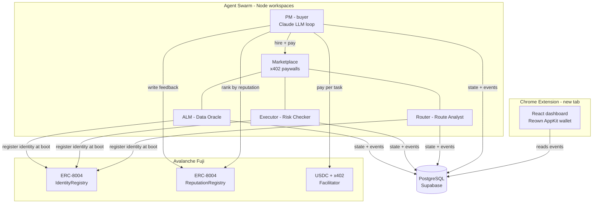

<div align="center">

# 🌐 Ava Swarm

### Agents that hire agents — a self-organizing DeFi swarm in your new tab.

A Chrome new-tab page that replaces the blank slate with a live **DeFi command center**, powered by a four-agent swarm that **discovers, pays, and rates each other autonomously** on Avalanche — combining **[x402](https://x402.org) micropayments** with **[ERC-8004](https://eips.ethereum.org/) on-chain agent reputation**.

</div>

---

## ✨ The big idea

Most "AI agent" demos are one model in a loop. **Ava Swarm is a market.**

A lead **Portfolio Manager (PM)** agent breaks a job into sub-tasks, then goes shopping: it ranks specialist agents by their **on-chain reputation**, **pays the best ones per task in USDC** (gasless, no human in the loop), grades the work they return, and writes that grade **back on-chain** — which reshuffles who gets hired next round.

No API keys. No logins. No trust assumptions. Just **payments and reputation, settled on Avalanche.**

```
        ┌─────────────────────────────────────────────────────────────┐
        │  PM ranks specialists by ERC-8004 reputation                 │
        │            │                                                 │
        │            ▼                                                 │
        │  PM pays the top picks per task via x402  ──►  USDC on Fuji  │
        │            │                                                 │
        │            ▼                                                 │
        │  Specialist does the work, returns a result                 │
        │            │                                                 │
        │            ▼                                                 │
        │  PM scores it 0–100 and writes ERC-8004 feedback ───┐        │
        │            │                                        │        │
        │            └──── changes next round's ranking ◄─────┘        │
        └─────────────────────────────────────────────────────────────┘
```

Every payment and every rating is a real on-chain transaction with a **[Snowtrace](https://testnet.snowtrace.io)** link in the dashboard.

---

## 🛒 The marketplace

Three of the swarm's four agents become **sellers**, each exposing a single x402-gated endpoint that settles to **its own wallet**. The PM is the **buyer**.

| Specialist | Role | Endpoint | Price | Sells |
|---|---|---|---|---|
| 🧭 **Route Analyst** | `router` | `POST /quote-route` | `$0.01` | Best-route + quote analysis for a swap |
| 🛡️ **Risk Checker** | `executor` | `POST /risk-check` | `$0.01` | Pre-trade risk assessment for a token + size |
| 📊 **Data Oracle** | `alm` | `POST /price` | `$0.005` | Token price + sentiment snapshot |

How a single hire works:

```
PM ──POST /quote-route──────────────►  Marketplace
   ◄──402 Payment Required────────────  (price, network, payTo)
PM ──signs USDC authorization──────►   Facilitator settles on Fuji
   ◄──200 OK + result + tx hash──────  handler runs only after payment clears
PM ──giveFeedback(agentId, score)──►   ReputationRegistry (on-chain)
```

> The work each specialist sells is intentionally lightweight and deterministic — per the Speedrun's "start small" guidance, the value on display is the **autonomous payment + reputation loop**, not analytics fidelity.

---

## 🏗️ Architecture



Each agent runs as its **own OS process** (`tsx`), holds a fixed service keypair, and persists its slice of state to shared Postgres via Prisma. The dashboard reads those events to render reputation scores, live payments, and settlement links.

---

## 🚀 Quickstart

> **Prerequisites:** Node 20+ (22 tested), a [Foundry](https://book.getfoundry.sh) toolchain, a Supabase project, a [Reown](https://cloud.reown.com) project ID, and a Fuji wallet funded with test-USDC + a little AVAX from the [Avalanche faucet](https://faucet.avax.network).

### 1 — Deploy the ERC-8004 registries to Fuji

```sh
cd contracts
forge test                                        # registries pass unit tests
forge script script/DeployErc8004.s.sol:DeployErc8004 \
  --rpc-url avalanche-fuji --broadcast --private-key $DEPLOYER_PRIVKEY
# paste the two logged addresses into agents/.env (ERC8004_*_ADDRESS)
```

### 2 — Boot the swarm

```sh
cd agents
cp .env.example .env            # set USE_TESTNET=true, ERC8004_* addrs, X402_FACILITATOR_URL,
                                # Supabase URLs, and the 4 service privkeys
npm install
npm run prisma:generate && npm run prisma:migrate
npm run dev:all                 # api · pm · alm · router · executor · marketplace
```

On boot: specialists register ERC-8004 identities, the marketplace serves x402 paywalls, and the PM starts hiring.

### 3 — Run the dashboard

```sh
cp .env.example .env            # paste your VITE_REOWN_PROJECT_ID
npm install --legacy-peer-deps  # see note below
npm run dev                     # http://localhost:5173
```

Open the **Agent Marketplace** panel and watch reputation scores climb, payments stream in, and Snowtrace links appear for every settlement.

> **Why `--legacy-peer-deps`?** `@reown/appkit-adapter-wagmi` pulls a transitive package whose peer-dep graph trips npm's strict resolver. The flag is harmless — every version is pinned in `package.json`.

### Load as a real Chrome extension

```sh
npm run build                   # → self-contained unpacked extension in dist/
```

1. Open `chrome://extensions` → enable **Developer mode**
2. **Load unpacked** → select `dist/`
3. Open a new tab → the dashboard renders → click **Connect** for the Reown modal

---

## 🧩 Tech & sponsor map

| Layer | What we use |
|---|---|
| **Agentic payments** | [x402](https://x402.org) — `x402-express` paywalls, `x402-fetch` buyer, hosted facilitator settling USDC on Fuji |
| **Agent identity & trust** | [ERC-8004](https://eips.ethereum.org/) `IdentityRegistry` + `ReputationRegistry`, deployed via Foundry |
| **Chain** | Avalanche Fuji (43113) · USDC · Snowtrace |
| **Frontend** | Vite · React 18 · TypeScript · TailwindCSS · Reown AppKit · Wagmi · viem · React Query · `@crxjs/vite-plugin` (MV3) |
| **Backend** | Node + `tsx` · npm workspaces · Prisma + PostgreSQL (Supabase) · Express |
| **Inter-agent comms** | Gensyn AXL pub/sub |
| **Execution (legacy path)** | Uniswap Trading API + v4 SDK · KeeperHub — present but idle on Fuji; the active path is x402 + ERC-8004 |

---

## 📁 Project structure

```
defi-swarm-newtab/
├── src/                     # React new-tab dashboard (the extension UI)
│   ├── config/              #   appkit · wagmi · chains
│   ├── components/          #   layout · portfolio · agents · news · common
│   ├── hooks/ · lib/ · types/
│   └── pages/NewTab.tsx
├── manifest.config.ts       # @crxjs MV3 manifest source
│
├── agents/                  # the swarm backend (npm workspaces)
│   ├── shared/              #   @swarm/shared — db, AXL, crypto, chain, specialists, env
│   ├── pm/                  #   Portfolio Manager — the buyer (hire.ts)
│   ├── marketplace/         #   x402-gated seller storefront
│   ├── router/ executor/ alm/   # the three specialist sellers
│   └── api/                 #   dashboard-facing API
│
└── contracts/               # Foundry project
    └── src/erc8004/         #   IdentityRegistry.sol · ReputationRegistry.sol
        └── OTCMediator.sol
```

---

## 📜 Scripts

**Extension (repo root)**

| Script | Does |
|---|---|
| `npm run dev` | Vite dev server |
| `npm run build` | Type-check + build unpacked extension to `dist/` |
| `npm run typecheck` | `tsc --noEmit` |
| `npm run lint` | ESLint over `src/` |

**Swarm (`agents/`)**

| Script | Does |
|---|---|
| `npm run dev:all` | All six services with colored, named logs |
| `npm run dev:pm` / `dev:marketplace` / … | A single service |
| `npm run prisma:migrate` | Apply schema to Supabase |

---

<div align="center">

**Built for the Agentic Payments Speedrun** · Avalanche Fuji · x402 × ERC-8004

*Agents discover. Agents pay. Agents rate. No humans required.*

</div>
